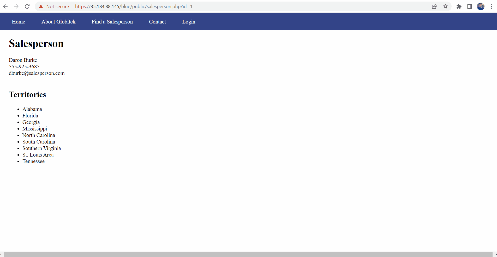
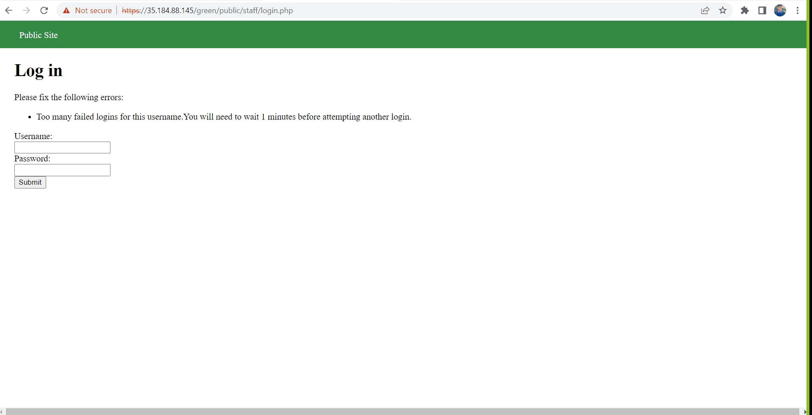
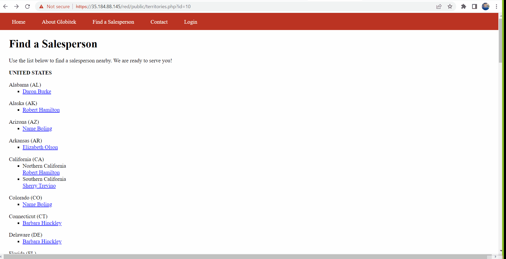

# ProjectUnit8
Project Unit 8

# Pen Testing Live Targets

Time spent: **5** hours spent in total

> Objective: Identify vulnerabilities in three different versions of the Globitek website: blue, green, and red.

The six possible exploits are:

* Username Enumeration
* Insecure Direct Object Reference (IDOR)
* SQL Injection (SQLi)
* Cross-Site Scripting (XSS)
* Cross-Site Request Forgery (CSRF)
* Session Hijacking/Fixation

Each color is vulnerable to only 2 of the 6 possible exploits. First discover which color has the specific vulnerability, then write a short description of how to exploit it, and finally demonstrate it using screenshots compiled into a GIF.

## Blue

Vulnerability #1: SQL Injection

Description: In the Find a Salesperson page, I used SQL injection in the URL. I injected code into the GET for id part of the URL https://35.184.88.145/blue/public/salesperson.php?id= This vulnerability enables the attacker to gain insecure access to the details in the tables and columns in the database. 

```mysql
' AND 0 UNION SELECT 1,2,3,4,GROUP_CONCAT(table_name,0x2e,column_name,"\n") FROM information_schema.columns WHERE table_schema=database()--'
```




## Green

Vulnerability #1: Username Enumeration
Description: Username Enumeration
Description: When entering jmonroe99 in the username field on the Blue, Red, and Green machines, I noticed that all three machines responded with "Log in was unsuccessful." in bold. However, when entering an invalid username on all three machines, the green machine displayed the "Log in was unsuccessful." message NOT in bold. this shows that the when the developer programmed the green machine to display the resonses in both cases; when a username was valid and when a username was invalid (both with incorrect passwords), the developer thought that he/she was setting the same response message: Log in was unsuccessful. However, he/she forgot to make the message bolded in the senario in which an incorrect username was entered. Noticing this inconsistency lets a hacker know if a username is valid or not. This user enumeration vulnerability is a security threat because it helps the hacker with the first step inobtaining confidential login credentials because the hacker now knows the username of a valid account. 




## Red

Vulnerability #1: IDOR
On the Blue and Green machines, I could not view the salseperson information for 10 and 11 because they were inactive. These two were Lazy Lazyman (FIRED FOR STEALING) and Testy McTesterson (NOT PUBLIC UNTIL SEPT. 1). However, on the Red machine I was able to access the information for both of these insecurely from the public side. All I had to do was directly refernce the ID number for each of them from the URL, and I was able to see them even from the public site. I could not have accessed them just by using the user interface of the website because I wasn't supposed to be abler to do that from the public side.




## Notes

Describe any challenges encountered while doing the work
The challenge I ecountered was that I initially only saw the timeout response on the red machine so I thought that was my answer. However, after trying to repeatedly enter the same username on the blue and green machine, I found that they also displayed the same message. So I had to backtrack a little and focus on just the initial message of "Log in was unsuccessful.", and that's when I found the inconsistency.
